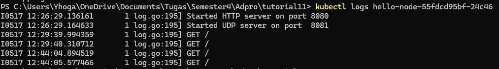

# Pemrograman Lanjut A
> Fadrian Yhoga Pratama - 2206819395

## Module 11 - Deployment on Kubernetes

## Reflection on Hello Minikube
1. **Compare the application logs before and after you exposed it as a Service.** 

Dapat dilihat dari log bahwa aplikasi awalnya diakses secara langsung dalam pod sebelum diubah menjadi service. Log mencatat pesan-pesan awal (start server HTTP on port 8080) dan setiap request yang masuk (GET /). Setiap kali aplikasi diakses dalam pod, log mencatat request tersebut. Namun, setelah aplikasi diubah menjadi service dengan menggunakan minikube service hello-node, log masih mencatat pesan-pesan awal dan request yang masuk seperti sebelumnya, tetapi sekarang aplikasi diakses melalui service yang mengarahkan traffic ke pod.

2. **Notice that there are two versions of `kubectl get` invocation during this tutorial section.The first does not have any option, while the latter has `-n` option with value set to `kube-system`. What is the purpose of the `-n` option and why did the output not list the pods/services that you explicitly created?** 
Opsi `-n` dalam perintah `kubectl get` digunakan untuk menentukan namespace tempat resource Kubernetes berada. Jika menjalankan `kubectl get` tanpa opsi `-n`, perintah tersebut akan menampilkan resource dalam namespace default.
Saat menjalankan `kubectl get -n kube-system`, perintah tersebut akan menampilkan resource yang ada dalam namespace `kube-system`, bukan namespace default. Namespace `kube-system` adalah tempat sistem Kubernetes sendiri menjalankan resource pentingnya.
Jadi, jika pods atau services yang dibuat secara eksplisit tidak muncul dalam output, kemungkinan besar karena mereka berada di namespace lain, bukan `kube-system`. 